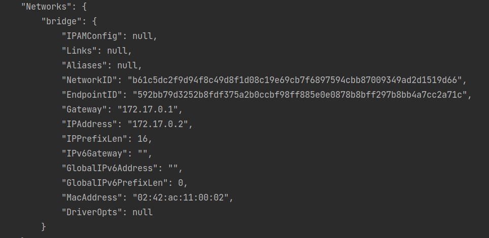

## L7-L8

### Using docker to run the client 
docker run -v "$(pwd):/home" -it python:latest /bin/bash

#### Docker network

#### Example 3.4.1 running client on Docker

### 3.2.1
#### Server

#### Client

### 3.2.2
#### Server
It remains the same

#### Client

### 3.2.3

### 3.3.1 
#### Server

#### Client

### 3.4.1
#### Server

#### Client

### 3.5.1
#### Server

#### Client

### 3.6.1
#### PPrint

### 3.7.1
Following: http://times.usefulinc.com/2006/09/29-portmap-security

